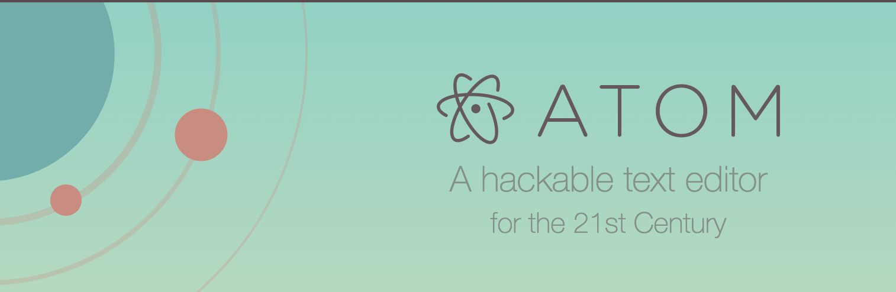
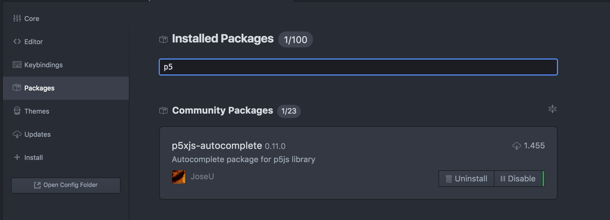

##Curso p5.js

Esta es una breve guia de para tener todos los elementos a mano del curso de p5.js. Este documento se irá completando conforme el curso avance.

###Intro

Cuando Ben Fry y Casey Reas ayudados por Maeda iniciaron el desarrollo de processing querían buscar el símil del lienzo en el código. 15 años después podemos decir que processing a inspirado a miles de artistas por todo el mundo, no solo creando obras de arte con esta herramienta, también pensando nuevas herramientas con propósitos diferentes.

Lauren McCarthy es la creadora P5.js  es la versión para la web de processing. Es un proyecto open source creado en comunidad y soportado por la fundación processing. Con un enfoque moderno y pensado en poder usarse con un navegador p5.js está cogiendo mucha fuerza.

Este taller es una introducción tanto a processing como a p5.js, se verán los fundamentos básicos de p5.js, pero también su potencia.
Hablaremos de forma, animación, transformaciones. Pero también de variables, bucles, el DOM o lo que es un servidor web.

Unir el código con la web siempre fue una buena idea. Hacerlo desde la periferia lo es aún más.

###P5.js
Es como processing pero para la web, por lo tanto hay un cambio de paradigma, su enfoque es distinto y su forma de trabajar también. Es cierto que en un inicio el concepto del Sckech sea parecido, pero no tenemos que olvidar que estamos trabajando en un entorno web y eso es bueno.

###Ide/editor
Todo lo necesario para trabajar esta en la propia web de processing [http://p5js.org/](http://p5js.org/) en la sección get-started indica los paso, pero aquí hago un breve resumen.

En processing tenemos el editor en el propio programa de ejecución, pero en p5js podemos usar cualquier editor mi recomendación es atom

Ventaja de Atom, es libre es ya es suficiente, se le puede poner el keybinding de vim (indispensable si eres una persona sensata) y en este caso hay un paquete específico de p5js que ayuda mucho.

###Navegador
Las cosas como son el que más fino va es el chrome, firefox guay, safari caca. Para el curso tiraremos de chrome para simplificar alguna parte.

[https://www.google.com/chrome/browser/desktop/index.html](https://www.google.com/chrome/browser/desktop/index.html)

###Material
En este [github](https://github.com/karlosgliberal/cursop5js) tenemos el material con el que vamos a trabajar.

Enlaces

[http://interzonas.info/](http://interzonas.info/)
[http://p5js.org/](http://p5js.org/)
[http://lauren-mccarthy.com/](http://lauren-mccarthy.com/)
[http://shiffman.net/](http://shiffman.net/)
[http://genekogan.com/](http://genekogan.com/)
[http://www.saigesp.es/p5js-desde-processing/](http://www.saigesp.es/p5js-desde-processing/)
[https://vimeo.com/60731302](https://vimeo.com/60731302)
[https://www.kadenze.com/courses/introduction-to-programming-for-the-visual-arts-with-p5-js-vi/](https://www.kadenze.com/courses/introduction-to-programming-for-the-visual-arts-with-p5-js-vi/)

Referencia para meter: http://p5js.org/examples/color-hue.html
